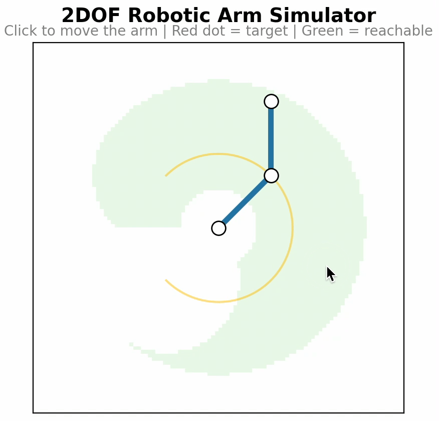

# 2-DOF Interactive Robotic Arm Simulator

An interactive **2-degree-of-freedom robotic arm** simulator that visualizes **forward and inverse kinematics** in real time.  
Built using **Python**, **NumPy**, **matplotlib**, and **Streamlit**.

  

---

## Overview
This project simulates a planar robotic arm to demonstrate how inverse kinematics algorithms compute joint angles for a desired end-effector position.  
It’s designed for learning and experimentation, inspired by robotics coursework and my interest in real-time visualization.

---

## How It Works

- The simulator models a two-link robotic arm moving in a 2D plane.  
- When a user selects a target point, the program calculates the joint angles needed for the arm’s end-effector to reach that position using standard inverse kinematics geometry.  
- Forward kinematics is then used to determine the position of each joint and link.  
- The arm visualization updates in real time as the target moves, with joint-limit constraints enforced to keep the motion realistic.  
- This allows users to explore how link lengths and target positions affect the arm’s configuration.

---

## Tech Stack
| Component | Description |
|------------|-------------|
| **Python** | Core computation |
| **NumPy** | Vector math and trigonometry |
| **matplotlib** | 2D visualization |
| **Streamlit** | Web-based interactivity |

---

## Next Steps
- Extend to 3-DOF manipulator  
- Add end-effector path tracking  
- Implement Jacobian-based control  

---

> _Originally documented in detail on [Notion](https://www.notion.so/2DOF-Interactive-Robotic-Arm-Simulator-20cae213ff5e80b7b406f53534af894b)_
